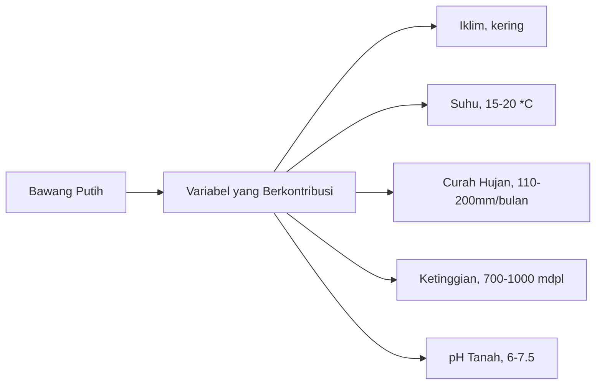

> Artikel ini merupakan adaptasi dari paper berikut.
>
> [Pemodelan Daerah Potensial Pertanian di Indonesia sebagai Usaha Restorasi Ekonomi pada Masa Pandemi COVID-19 menggunakan Metode Hierarchical Clustering](https://www.researchgate.net/publication/351079613_Pemodelan_Daerah_Potensial_Pertanian_di_Indonesia_sebagai_Usaha_Restorasi_Ekonomi_pada_Masa_Pandemi_COVID-19_menggunakan_Metode_Hierarchical_Clustering)

{}

{}

Pada artikel kali ini penulis akan menjabarkan proses _data mining_ dari salah satu paper yang penulis buat menggunakan Orange Data Mining. Paper ini merupakan submisi penulis pada lomba GEMASTIK XIII dan sayangnya tidak lolos dan diikutsertakan kembali pada lomba CODIG Mercubuana 3.0 dan berhasil masuk sebagai finalis.

## Metode Penelitian

Pada penelitian ini penulis mengambil studi kasus untuk melakukan _clustering_ potensi provinsi di Indonesia untuk digunakan sebagai daerah pertanian. Pada kasus ini komoditas yang dipilih adalah bawang putih karena bawang putih selain menjadi salah satu rempah yang menjadi bahan pokok di masakan lokal Indonesia, datanya juga saat itu mudah didapatkan oleh penulis. Setelah memilih apa komoditas yang akan dijadikan dasar pemodelan, tahap selanjutnya adalah mengidentifikasi apa saja variabel yang berkontribusi terhadap pertumbuhan bawang putih.

Berdasarkan variabel-variabel di atas, penulis mulai mencari sumber data dari beberapa sumber seperti BMKG dan sumber data terbuka di GitHub, Kaggle, dan Our World in Data. Pada akhirnya penulis berhasil mengumpulkan beberapa data yang memiliki relasi kuat dengan faktor-faktor yang sebelumnya sudah ditentukan.

Kamu bisa unduh dataset yang sudah penulis kurasi dari berbagai sumber pada tautan di bawah ini.

[⬇️ Download Dataset](https://kodesianastorage.blob.core.windows.net/kodesiana-public-assets/datasets/017-pemodelan-daerah-potensial-pertanian.csv)

| Atribut             | Tipe Data | Keterangan                                                  |
| ------------------- | --------- | ----------------------------------------------------------- |
| latitude            | float     | Koordinat pada garis bujur bumi                             |
| longitude           | float     | Koordinat pada garis lintang bumi                           |
| volume_hujan        | float     | Volume hujan dalam kurun waktu satu tahun                   |
| jumlah_hari_hujan   | integer   | Berapa banyak hari turun hujan dalam kurun waktu satu tahun |
| suhu_avg            | float     | Rata-rata suhu udara dalam kurun waktu satu tahun           |
| tekanan_udara       | float     | Rata-rata tekanan udara dalam kurun waktu satu tahun        |
| penyinaran_matahari | float     | Rata-rata luas penyinaran matahari                          |

Seperti yang terdapat pada tabel di atas, terdapat beberapa variabel yang tidak sama persis dengan faktor-faktor yang ada pada diagram tetapi dapat mengimplikasikan faktor-faktor tersebut misalnya ketinggian berkorelasi dengan tekanan udara, semakin tinggi suatu daerah maka tekanan udara akan semakin rendah dan begitu pula sebaliknya. Berdasarkan informasi ini informasi kualitatif (dataran tinggi, dataran rendah) bisa diturunkan dari informasi kuantitatif (tekanan udara).

## Pemodelan menggunakan Clustering

Seperti yang sudah dijelaskan sebelumnya bahwa target dari penelitian ini adalah membuat _cluster_ mana saja daerah yang cocok untuk ditanami bawang putih berdasarkan faktor-faktor yang sudah ditentukan. Pada penelitian ini akan digunakan metode _hierarchical clustering_ menggunakan _average linkage_ untuk menentukan _cluster-cluster_ daerah. Setelah didapatkan _cluster-cluster_ daerah, tahap selanjutnya adalah menggabungkan data _cluster_ dengan dataset asli untuk membuat visualisasi berupa diagram kotak garis untuk menginterpretasi karakteristik setiap atribut pada cluster tersebut dan memvisualisasikan daerah _cluster_ pada peta.

Buka aplikasi **Orange Data Mining**.

Tambahkan widget **Data > File**. Setelah itu pilih file CSV yang sudah kamu unduh dari tautan di atas. Pastikan semua kolom dan _role_ sama seperti di bawah ini.

Setelah kamu menambahkan widget _File_, kamu bisa menggunakan widget _Data Table_ untuk melihat isi dataset.

Setelah kamu berhasil memuat data, tahap selanjutnya adalah memilih atribut yang akan digunakan untuk melakukan _clustering_. Ingat bahwa pada data ini terdapat atribut `latitude` dan `longitude` yang merupakan koordinat provinsi pada peta dan pada hakikatnya koordinat ini tidak termasuk pada faktor yang berkontribusi pada pertumbuhan bawang putih, maka dari itu kolom tersebut perlu dibuang terlebih dahulu.

Tambahkan widget _Select Columns_ kemudian geser atribut `latitude` dan `longitude` dari daftar _Features_ ke daftar _Ignored_.

Setelah kamu memilih kolom yang akan digunakan pada proses _clustering_, tahap selanjutnya adalah menambahkan widget _Unsupervised > Distances_ dan _Hierarchical Clustering_.

- Pada widget **Distances**, ubah _Distances between_ menjadi _Rows_ dan _Distance Metric_ menjadi _Cosine_.
- Pada widget **Hierarchical Clustering**, ubah _Linkage_ menjadi _Average_ dan kamu juga bisa menambahkan anotasi dengan memilih atribut _provinsi_ pada bagian _Annotations_. Pastikan _Top N_ adalah 5 yang artinya kita akan memilih lima hierarki teratas sebagai _cluster_.

Sampai di sini kita sudah memiliki _cluster_ untuk tiap-tiap provinsi di Indonesia. Berdasarkan dendogram di atas (struktur hierarki di atas disebut dendogram) bisa dilihat terdapat lima _cluster_ dan masing-masing nama provinsi yang masuk ke dalam _cluster_ tersebut.

Sebelum melanjutkan proses untuk menginterpretasi karakteristik tiap-tiap _cluster_, kita akan melakukan visualisasi _silhouette scores_ untuk kelima _cluster_ yang sudah dibuat. Metode evaluasi menggunakan _silhouette score_ ini merupakan salah satu metode evaluasi _cluster_ yang paling mudah digunakan. Secara umum _silhouette score_ menunjukkan jarak rata-rata antara titik data pada cluster dibandingkan dengan jarak dengan cluster lain, sehingga semakin besar _silhouette score_ berarti titik data berada jauh dari _cluster_ lainnya dan dapat disimpulkan bahwa titik data tersebut sudah masuk ke dalam _cluster_ yang tepat. Tentu interpretasi ini bukan alasan terbaik, kamu bisa coba pelajari lagi mengenai _silhouette score_ dan juga metrik-metrik lain untuk mengevaluasi _cluster_ seperti Davies-Bouldin Index.

Untuk membuat plot _silhouette score_, tambahkan widget _Visualize > Silhouette Plot_, kemudian hubungkan dengan output dari _Hierarchical Clustering_.

Dapat dilihat pada plot di atas ada beberapa sampel data yang memiliki nilai _silhouette score_ yang negatif, artinya titik data tersebut memiliki jarak yang lebih dekat dengan _cluster_ tetangganya dibandingkan dengan _cluster_-nya saat ini. Tetapi pada kasus ini kita akan melanjutkan ke proses interpretasi _cluster_ dan mengabaikan galat ini. Tentu akan lebih baik kalau kamu bisa menggunakan metode _clustering_ lain untuk menghindari adanya pencilan/_outlier_ seperti ini :D.

Sebelum kita bisa memvisualisasikan data yang sudah kita _cluster_, kita perlu menggabungkan data _cluster_ yang sudah kita buat dari proses _hierarchical clustering_ ke dalam dataset awal yang kita punya.

Tambahkan widget _Data > Merge Data_, kemudian pilih _Append columns from Extra data_ dan pilih atribut _provinsi_ pada bagian _Row matching_. Selain itu kamu juga bisa menambahkan widget _Data Table_ untuk melihat data hasil _clustering_.

> Workflow pada tutorial ini sedikit berbeda dengan workflow asli pada paper, tetapi output yang dihasilkan sama.

Pada gambar di atas dapat dilihat bahwa tiap-tiap baris data pada dataset awal sudah memiliki _cluster_ hasil _hierarchical cluustering_. Untuk mempermudah proses interpretasi karakteristik tiap-tiap _cluster_, kita bisa menggunakan _Box Plot_.

Tambahkan widget _Visualize > Box Plot_, kemudian pilih variabel yang ingin kamu visualisasikan (misalnya `jumlah_hari_hujan`) dan pilih `Cluster` sebagai _Subgroups_.

_Box plot_ terdiri atas beberapa komponen, yaitu:

- Nilai paling ujung adalah Q1 (25%) dan Q3 (75%)
- Garis biru di tengah adalah _mean_ atau Q2 (50%)
- Garis panjang merupakan _median_

Pada _box plot_ di atas dapat dilihat bahwa C1 adalah _cluster_ dengan curah hujan paling sedikit dalam satu tahun dan C4 adalah _cluster_ dengan curah hujan paling banyak. Kamu bisa membuat _box plot_ untuk variabel-variabel lain untuk mengambil lebih banyak _insight_ untuk menentukan provinsi mana yang cocok untuk pertanian bawang putih.

> Widget _Box Plot_ dapat melakukan perbandingan antara _mean_ dan _median_ menggunakan ANOVA dan Chi-square
> Tetapi pada data ini karena terdapat satu _cluster_ yang memiliki satu titik data saja, maka tidak dapat dilakukan analisis signifikansi antara dua _mean_

Tahap terakhir dari proses _data mining_ pada penelitian ini adalah membuat visualisasi _cluster_ pada peta untuk melihat secara visual _clsuter_ dari tiap-tiap provinsi.

> Pastikan Anda sudah memasang Add-on Orange-Geo untuk memvisualisasikan data pada peta

Tambahkan widget _Geo > Geo Map_, kemudian pilih atribut `latitude` dan `longitude` pada grup koordinat peta dan pilih atribut `Cluster` pada kolom _Color_ dan _Shape_. Untuk menampilkan daerah arsiran warna _cluster_, centang pada _Show color regions_.

Dapat dilihat pada peta bahwa C1 yang merupakan provinsi yang paling kering terdapat di pulau Sulawesi dan secara umum _cluster-cluster_ pulau tersebar merata yang menunjukkan adanya variasi yang tinggi pada kondisi cuaca di Indonesia yang dapat memengaruhi potensi pertanian bawang putih.

## Simpulan

Dikutip dari paper,

1. C1, memiliki curah hujan paling sedikit dan kondisi cuaca panas kering.
2. C2, memiliki curah hujan yang sedikit dengan rata-rata 102 hari hujan, dengan penyinaran matahari yang bervariasi antara 51-84 hari dengan rata-rata suhu 27,3 °C.
3. C3, memiliki curah hujan sedikit lebih banyak dibandingkan C2, dengan penyinaran matahari yang lebih lama antara 65-84 hari dengan rata-rata suhu 27,13 °C.
4. C4, memiliki curah hujan paling banyak dengan rata-rata 145 hari hujan, memiliki penyinaran matahari yang paling sedikit, dan suhu yang paling dingin dibandingkan _cluster_ lainnya.
5. C5, memiliki curah hujan yang besar dengan rata-rata 145 hari hujan, memiliki penyinaran matahari antara 51,97 dan 72,51 hari, dengan suhu antara 27-27,9 °C.

Berdasarkan data tersebut, dapat disimpulkan bahwa _cluster_ C3 merupakan kandidat terbaik sebagai lokasi budidaya bawang putih. Provinsi yang termasuk pada _cluster_ C3 yaitu Banten, Bali, Nusa Tenggara Barat, Nusa Tenggara Timur, Sulawesi Barat, dan Papua.

## Penutup

Pada artikel ini kita telah merekonstruksi paper untuk melakukan _data mining_ menggunakan aplikasi _Orange Data Mining_ dengan studi kasus untuk melakukan _clustering_ untuk mengelompokkan provinsi-provinsi yang memiliki potensi sebagai daerah produsen bawang putih berdasarkan kondisi cuaca pada masing-masing provinsi.

Yuk kita coba pelajari bagaimana penggunaan _Orange Data Mining_ untuk melakukan proses analisis lain dan bagi teman-teman yang lebih suka versi video, teman-teman bisa cek _playlist_ YouTube penulis di mana penulis membahas beberapa studi kasus lain menggunakan aplikasi _Orange Data Mining_!

{}

{}

Terima kasih sudah membaca artikel kali ini, sampai jumpa nanti!
